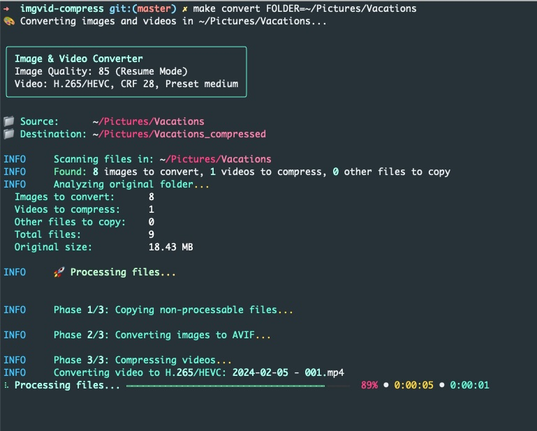

# Image & Video Converter

Convert images to AVIF and videos to H.265/AV1 while preserving folder structure and original files date time. The tool can resume interrupted runs and keeps non-media files in the output tree.



## Getting Started

### 1. Clone

```bash
git clone git@github.com:glonlas/imgvid-compress.git
cd imgvid-compress
```

### 2. Install (safe by default)

```bash
make install
```

Why this install flow is safe:

- Uses `uv` for deterministic and isolated Python dependency management.
- Creates a local project virtual environment in `.venv`.
- Installs packages into that project env, not into global system Python.
- Runs the app with `uv run ...`, so commands execute in the project environment.

What `make install` does:

- Installs `uv` if missing.
- Creates `.venv` if missing.
- Installs the project package.
- Checks FFmpeg and installs it when possible.

### 3. Run conversion

```bash
make convert FOLDER=~/Pictures/2025-Aug_Vacation
```

This creates `~/Pictures/2025-Aug_Vacation_compressed/` with:

- converted images/videos
- copied non-convertible files
- preserved subfolder structure

### 4. Preview first (recommended)

```bash
make dry-run FOLDER=~/Pictures/2025-Aug_Vacation
```

## Common Make Commands

```bash
make help
make convert FOLDER=/path/to/media
make dry-run FOLDER=/path/to/media
make test
make quality
```

## Conversion Examples

```bash
# Images only
make convert FOLDER=/path/to/media MODE=images

# Videos only
make convert FOLDER=/path/to/media MODE=videos

# Better image quality
make convert FOLDER=/path/to/media QUALITY=95

# Better video quality
make convert FOLDER=/path/to/media VIDEO_CRF=23

# Use AV1 (slower, often smaller output)
make convert FOLDER=/path/to/media VIDEO_CODEC=av1

# Re-run and force reconversion
make convert FOLDER=/path/to/media FORCE=1
```

## Quality and Open-Source Readiness

The project is configured to enforce quality locally and in CI:

- Linting and formatting: `ruff`
- Complexity analysis and gate: `radon`, `xenon`
- Tests and coverage: `pytest`, `pytest-cov` (100% gate)
- Commit-time checks: `pre-commit`
- Automated dependency updates: GitHub Dependabot

Setup:

```bash
make install-dev
```

Run full gate:

```bash
make quality
```

## Documentation

- [Feature Reference (Makefile + main.py)](docs/features.md)
- [Architecture](docs/architecture.md)
- [Key APIs](docs/key-apis.md)
- [Options and Usage](docs/options.md)
